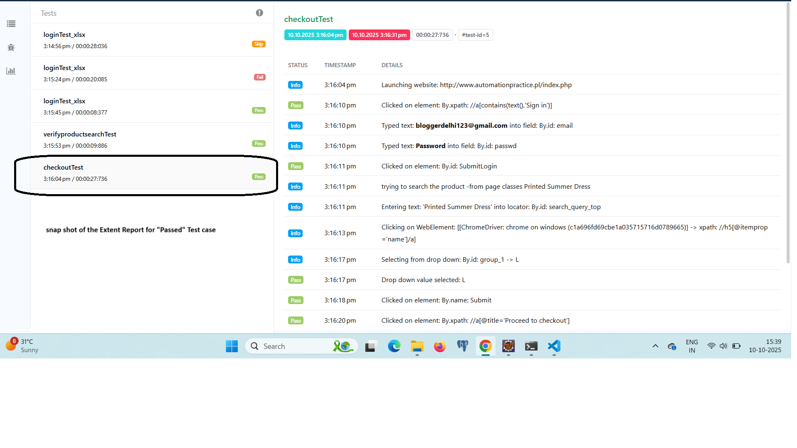
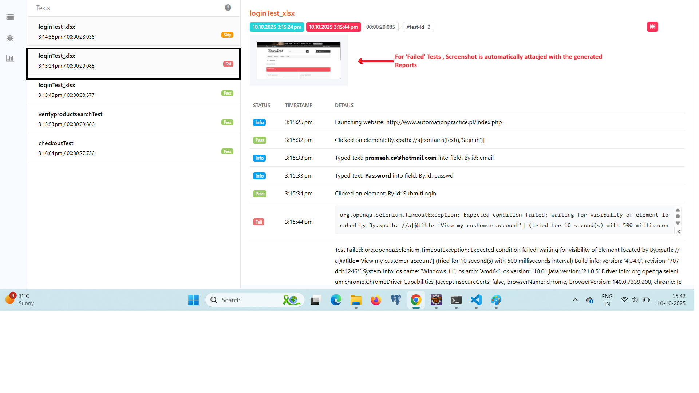

# 🚀 **Project Name :** selenium-dockerized-test-automation-framework


- A robust automation framework built on Selenium, Java, and TestNG with Page Object Model (POM).
Features include Dockerized execution, Jenkins CI/CD pipeline, Listeners, advanced reporting (ExtentReports), and support for cross-browser parallel testing.

## 🛒 **E-commerce Automation Framework:**
- This project is an End-to-End Automation Framework built for the demo e-commerce website:
-  **http://www.automationpractice.pl/index.php**

- The framework demonstrates professional test automation practices including Page Object Model (POM), data-driven testing, cross-browser execution, Listeners,   Dockerized test setup, and cloud execution on LambdaTest.

## 🛠️ **Tech Stack:**

- **Programming Language:** Java  
- **Automation Tool:** Selenium WebDriver  
- **Testing Framework:** TestNG  
- **Build Tool:** Maven  
- **Reporting:** Extent Reports  
- **Logging:** Log4j  
- **Listeners:** TestNG Listeners for event-driven reporting, screenshots, and logging  
- **Data Sources:** Excel (.xlsx), CSV, JSON  
- **Configuration:** .properties file  
- **CI/CD & Containerization:** Docker, Docker Compose, Jenkins  
- **Cloud Execution:** LambdaTest Integration  

## ✨ **Features:**

- **Page Object Design Pattern:** Clean and reusable code structure  
- **Data-driven Testing:** Supports Excel, CSV, JSON  
- **External Configuration:** Via `.properties` files  
- **Execution Modes:** Headless & UI mode (parameterized)  
- **Parallel & Distributed Testing:** Selenium Grid support  
- **Dockerized Setup:** Run tests in containers via `docker-compose.yml`  
- **Cloud Execution:** LambdaTest with easy configuration switch  
- **Reporting:** Detailed Extent Reports with step-level logs  
- **Screenshot Capture:** On test failure via TestNG Listeners  
- **Event-driven Listeners:** TestNG Listeners for reporting, logging, automatic failure handling  
- **Logging:** Log4j integration for better debugging  
- **Build & CI Support:** Maven Surefire Plugin for terminal/CI execution  
- **CI/CD Integration:** Jenkins pipelines for automated test execution

## 📂 Project Structure:
```
src
└── test
    └── java
       ├── base # Base classes & driver setup
       ├── pages # Page Object Model classes
       ├── tests # Test cases
       ├── utils # Utility classes (data readers, config, etc.)
       └── listeners # TestNG Listeners (screenshot, reporting, logging)

resources
├── testdata # .xlsx, .csv, .json files
├── config.properties
└── log4j.properties
```

## 🚀 **How to Run**
```
1. Clone the repository
- git clone https://github.com/pramesh01/selenium-dockerized-test-automation-framework.git
- cd selenium-ecommerce-framework

2. **Run tests via Maven**

- mvn clean test

3. **Run with parameters** 
   > . Headless Mode & Grid Execution:

  - mvn clean test -DisHeadless=true -DisGridEnabled=true

  **Run on Cloud [LambdaTest Environment]** 
> **Note:** Free minutes have been exhausted on LambdaTest, so cloud execution is not demonstrated here. , 
- But via mentioning following u can also run on cloud:
- **mvn clean test -DisLambdaTestEnabled=true**
  [This will execute tests over LambdaTest cloud environments.]

4. **Run using Docker**
- Implemented test cases in a **separate repository** with a `Jenkinsfile` to run tests inside Docker containers.  
- Repository link: [selenium-docker-runner](https://github.com/pramesh01/selenium-docker-runner.git)  
- Additional configuration files created in this repository:  
  - `grid.yaml`  
  - `test_suite.yaml`  
  These files contain image names and other execution details.
  > **Note:** Configure the Jenkins job and execute. The execution will start automatically, and reports & logs will be generated.
```
## 5. Test Cases Implemented

- Register New User
- Login Test (valid credentials)
- Login Test (For invalid credentials)
- Search Test
- End-to-End Checkout Flow

## 6- **📊 Reports & Logs & Screenshots on Failure**

- **Extent Reports:** target/Reports/ExtentReport.html
- **Logs:** logs/automation.log
- **Screenshots on Failure:** Screenshots/ folder
- **Listeners:** Automatically capture screenshots, log steps, and attach reports

### Sample ExtentReport Screenshots

**Passed Test Cases Report**


**Failed Test Cases Report**


**🔮 Future Enhancements**
- will Enhance ExtentReports by replacing raw technical logs (e.g., “Clicked on element: By.xpath: //a[@title='Proceed to checkout']”) with clean, human-readable test steps, like “Clicked on Proceed to Checkout button”, along with inline screenshots for each step.
- Additionally, i will integrate Docker-based video recording to capture the entire test execution flow for better debugging and visual analysis.
- Will add **Allure Reports** as an alternative reporting mechanism
- Expand test coverage with more e-commerce scenarios

## **👨‍💻 Author:**
  **Pramesh Kumar**
  - QA Automation | Selenium | Java | Docker | CI/CD | Cloud Testing